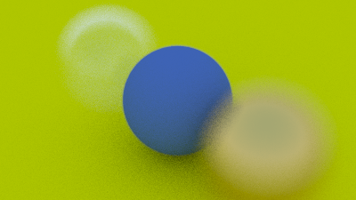

# Chapter12 Defocus Blur 失焦模糊
## 前言
Defocus Blur是一种模糊效果，通常用于模拟相机的焦外效果。

在摄影中，焦外效果是指当物体不在相机的焦点范围内时，该物体的影像会变得模糊。焦外效果可以产生深度感，突出主体并模糊背景，从而创建出艺术性的效果或者引导观看者的注意力。

在计算机图形学中，通过算法模拟焦外效果可以增加真实感和视觉品质。Defocus模糊就是一种常用的模拟焦外效果的技术。

Defocus模糊通常基于深度信息进行计算。具体而言，可以使用深度缓冲区中的信息来确定每个像素点距离相机的距离。根据距离的远近，像素点的模糊程度被计算出来。

在实现Defocus模糊时，通常会使用半径和强度参数来控制模糊的程度。半径参数定义了模糊的范围，而强度参数则调整模糊的强度。通常，半径较大的模糊效果更加明显，而强度较高的模糊则更加显著。

Defocus模糊可以应用于实时渲染中的三维场景，也可以用于后期处理中。在后期处理中，可以基于深度信息进行Defocus模糊的计算，并将其应用于图像或者视频序列中的特定区域，以达到艺术效果或增强视觉吸引力。

总结而言，Defocus模糊是一种模拟焦外效果的技术，通过使用深度信息来计算像素点的模糊程度，从而实现增加真实感和视觉品质的效果。本章节将通过光线追踪技术来实现该效果。
## 原理
请先注意，所有摄影师都会称这个效果为“景深”（depth of field），所以沟通时还需要注意术语。

我们之所以在真实相机中会存在失焦模糊，是因为它们需要一个大孔径（而不仅仅是小针孔）来收集光线。这将导致所有物体模糊不清，但如果我们在孔径上放置一个镜头，就能找到一个特定距离，使得所有物体都处于焦点之内。可以这样理解镜头：来自焦距处的所有光线，经过镜头时都会被弯曲到图像传感器中的一个点上。

我们将投影点与所有物体都完全聚焦的平面之间的距离称为焦距。请注意，焦距不同于焦距长度（focal length）——焦距长度是投影点与图像平面之间的距离。

在实际相机中，焦距通过镜头与底片/传感器之间的距离来控制。这就是为什么当你改变焦点时，会看到镜头相对于相机移动（这在手机相机中也可能发生，不过手机中是传感器移动）。所谓的“光圈”就是一个控制镜头有效大小的孔径。对于真实相机来说，如果需要更多光线，就需要扩大光圈，从而得到更多的虚化模糊效果。而对于我们的虚拟相机来说，我们可以拥有一个完美的传感器，永远不需要更多的光线，所以只有当我们需要虚化模糊时才使用光圈。
## 近似实现薄透镜
实际相机由复杂的复合镜头组成。对于我们的代码，我们可以模拟以下顺序：传感器，然后是镜头，最后是光圈。然后我们可以找出光线的传播方向，并在计算完后翻转图像（图像在胶片上投影时是倒置的）。然而，计算机图形学领域通常使用薄透镜近似：


我们不需要模拟相机内部的任何内容。对于渲染相机外部的图像来说，那将增加不必要的复杂性。相反，我们通常从镜头开始发射光线，并将它们发送到焦平面（距镜头焦距为focus_dist的地方），在该平面上的所有物体都处于完美的焦点之中。


## 生成采样光线
通常，所有场景光线都源自视点（lookfrom point）。为了实现虚化模糊效果，我们需要生成从位于视点中心的一个圆盘内部发出的随机场景光线。圆盘的半径越大，虚化模糊效果就越明显。你可以将我们原始的相机视为具有半径为零的虚化圆盘（没有任何模糊效果），因此所有光线都起源于圆盘的中心点（lookfrom）。
````C++
vec3 random_in_unit_disk() {
    while (true) {
        auto p = vec3(random_double(-1,1), random_double(-1,1), 0);
        if (p.length_squared() >= 1) continue;
        return p;
    }
}
````
````C++
class camera {
    public:
        camera(
            point3 lookfrom,
            point3 lookat,
            vec3   vup,
            double vfov, // vertical field-of-view in degrees
            double aspect_ratio,
            double aperture,
            double focus_dist
        ) {
            auto theta = degrees_to_radians(vfov);
            auto h = tan(theta/2);
            auto viewport_height = 2.0 * h;
            auto viewport_width = aspect_ratio * viewport_height;

            w = unit_vector(lookfrom - lookat);
            u = unit_vector(cross(vup, w));
            v = cross(w, u);

            origin = lookfrom;
            horizontal = focus_dist * viewport_width * u;
            vertical = focus_dist * viewport_height * v;
            lower_left_corner = origin - horizontal/2 - vertical/2 - focus_dist*w;

            lens_radius = aperture / 2;
        }


        ray get_ray(double s, double t) const {
            vec3 rd = lens_radius * random_in_unit_disk();
            vec3 offset = u * rd.x() + v * rd.y();

            return ray(
                origin + offset,
                lower_left_corner + s*horizontal + t*vertical - origin - offset
            );
        }

    private:
        point3 origin;
        point3 lower_left_corner;
        vec3 horizontal;
        vec3 vertical;
        vec3 u, v, w;
        double lens_radius;
};
````
使用大光圈：
````C++
point3 lookfrom(3,3,2);
point3 lookat(0,0,-1);
vec3 vup(0,1,0);
auto dist_to_focus = (lookfrom-lookat).length();
auto aperture = 2.0;

camera cam(lookfrom, lookat, vup, 20, aspect_ratio, aperture, dist_to_focus);
````
最终出图：

